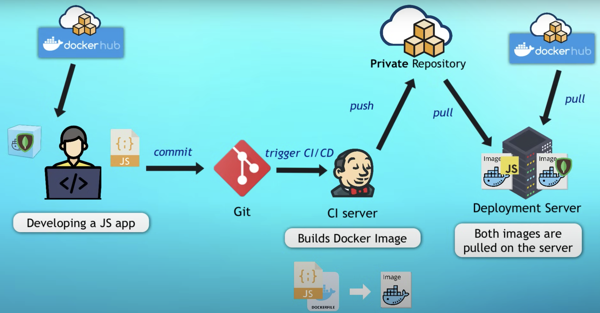

# Docker

## What is Docker?

* Virtualization software.
* Makes developing and deploying applications much easier.
* Packages application with all necessary dependencies, configuraion, system ools and runtime.
* Portable artifact, easily shared and distributed

### Development process before containers

* Each dev needs to install and configure all services diectly on their OS on thei local machine
* Installation process different for each OS enviroment
* Many steps, where something go wrong
* If the app uses 10 services, each dev needs to install those 10 services

### Development process with containers

* Own isolated enviroment
* Postgres packaged with all dependencies and configs
* Start service as a Docker container using 1 docker command
* Docker command same for all OS
* Commans same for all services
* Standardizes process of running any service on any local dev enviroment
* Easy to run differen versions of the same app without conflicts

### Deployment process before containers

* Artifact and instructions handed over to ops team
* Ops team handles installing and configuring apps and its dependencies
* Installations and configuration done directly on the server OS which can cause issues
  * Dependency version conflicts etc
* Miscomunications - textual guide of deployment

### Deployment process with containers

* Docker artifact includes everything that app needs
* Instead of textual, everything is packaged inside the Docker artifact
* No configurations needed on the server
  * (except Docker runtime)
* Run Docker command to fetch and run the Docker artifacts

## How does Docker run ts containers?

### How an OS is made up?

* OS Application Layer
  * Software that can be run on OS
* OS Kernel
  * Kernel is at the core of every operating system
  * Kernel interacts between hardware & software components

### Docker

* Uses Applications Layer only
* Services and apps installed on top of that layer

### VM

* Uses Application and Kernel Layers

### What affects has this difference?

#### Containers

* Docker images are much smaller
  * Couple of MB
* Containers take seconds to start
  * Reuses the host kernel
* Compatible only with Linux distros
* Docker desktop made it possible to run containers on Windows and Mac os.

#### VMs
* VM images are large
  * Couple of GB
* VMs take minutes to start
  * Needs to boot up a kernel in order to start
* VM is compatible with all OS

## Docker Images vs Docker Containers

### Docker Images

* An executable application artifact (simialar to zip)
* Includes app source code, but also complete enviroment configuration
  * Application (JS app)
  * Any services needed (node, npm)
  * OS Layer (Linux)
* Add enviroment variables, create directories, files etc.
* Immutable template that defines how a container will be realized
* Docker images are versioned
  * Different versions are identified by tags

### Container

* Actually starts the application
* A running instance of an image is a container
* We can run muliple containers from 1 image

## Docker commands

* `docker images` - show running images
* `docker ps` - show running containers
* `docker ps -a` - show all containers
* `docker logs <container_id>` - show container specific logs (`<container_name>` can also be used)
* `docker run <image_name>:<version>` - run docker image (creates new container every time the command is run)
* `docker stop <container_id>` - stop specific container
* `docker run -d -p <host_port>:<container_port> <image_name>:<version>` - run docker image and expose the port its runing to the computer its runing on eg. `docker run -d -p 9000:80 nginx:1.25.0`
* `docker start <container_id>` to start existing container
* `docker run --name web-app -d -p <host_port>:<container_port> <image_name>:<version>`- Add a name for the container `web-app`.
* `docker build -t <app_name>:<app_tag> .` - Build new image from dockerfile that is located in current working directory.

## Docker Registries

* A storage and distribution system for Docker images
* Official images available from applications like Redis, Mongo, Postgres etc.
* Official images are maintained by software authors or in collaboration with the Docker community
* Docker host one of the biggest Docker Registry called `Docker Hub` where we can find and share Docker images.
* On docker hub we can host private or public repositories for our applications.

### Private Registries

* With private containers we need to authenticate before accessing
* All big cloud providers offer private registries: Amazong ECR, Google Container Registry etc.

### Registry vs Repository

#### Docker Registry

* A service providing storage
* Can be hosted by a third party, like AWS or by yourself.
* Collection of repositories

#### Docker Repository

Collection of related images with the same name but different versions

## Container Port vs Host Port

* Application inside container runs in an isolated Docker network
* We need to expose the container port to the host (the machine container runs on)
* We can do this with `Port Binding` - Bind the container's port to the host's port to make the service available to outside world.
* Standard to use the same port on your host as container is using.

## Building own Docker Images

* Companies create custom images for their apps
* We want to deploy our app as a Docker container
* We need to create a `definition` of how to build an image from our application

### Dockerfile - Build Instruction

* Dockerfile is a text document that contains commands to assemble an image
* Docker can then build an image by reading those instructions

## Docker in development lifecycle

